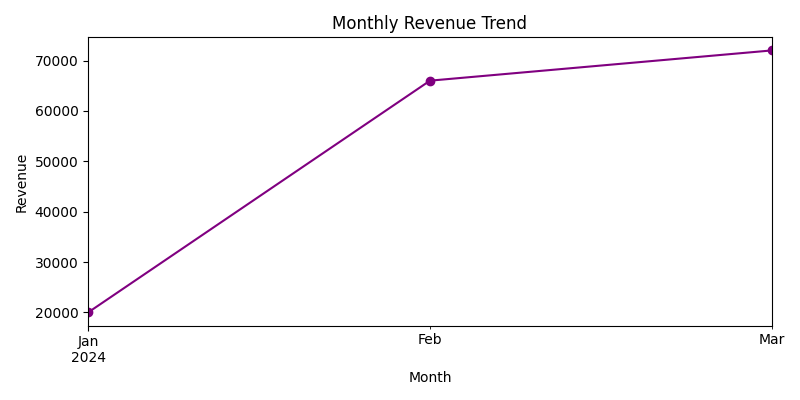
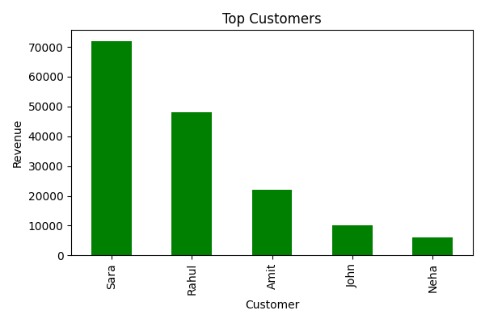
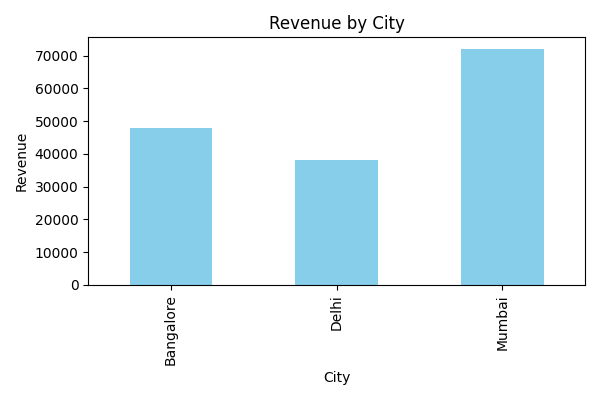
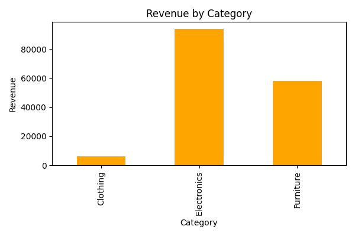

# E-Commerce Sales Analysis

## Overview
A Python data analysis project on e-commerce sales.  
Analyzes trends, top products, revenue by city/category, and customer insights.  
Charts are generated automatically and saved in the outputs folder.

## Features
- Calculate total revenue  
- Monthly sales trend visualization  
- Top-selling products  
- Revenue by city and category  
- Top customers analysis  
- Optional: interactive dashboard ready (Streamlit)

## Tech Stack
- Backend: Python  
- Data Analysis: Pandas, NumPy  
- Visualization: Matplotlib, Seaborn  
- Optional: Streamlit for dashboard  

## How to Run
Clone the repo: git clone https://github.com/huda242/ecommerce-analysis.git  
Install dependencies: pip install -r requirements.txt  
Run the analysis: python analysis.py  

> Charts will be saved automatically in the outputs/ folder

## Notes
Sample dataset included (data/data.csv). 
Modify CSV to analyze more complex datasets. 
Ensure outputs/ folder is created automatically.

## Screenshots

**Monthly Revenue Trend**  

**Top 10 Products**  

**Revenue by Region**  

**Revenue by Category**  

